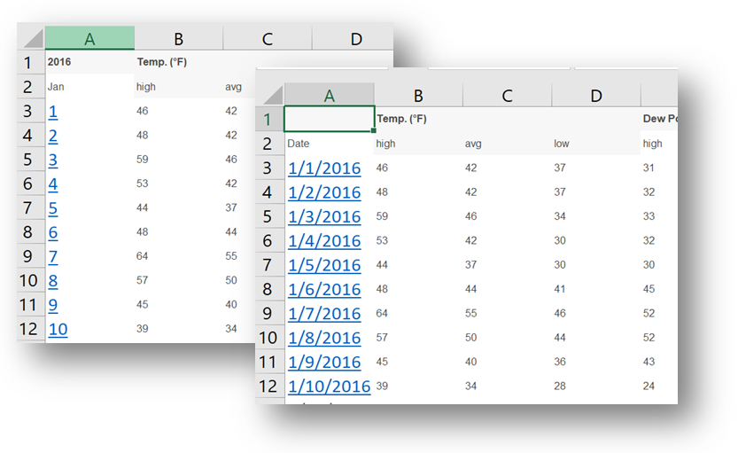
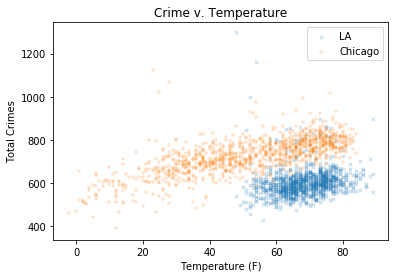
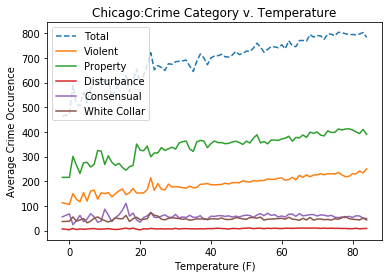
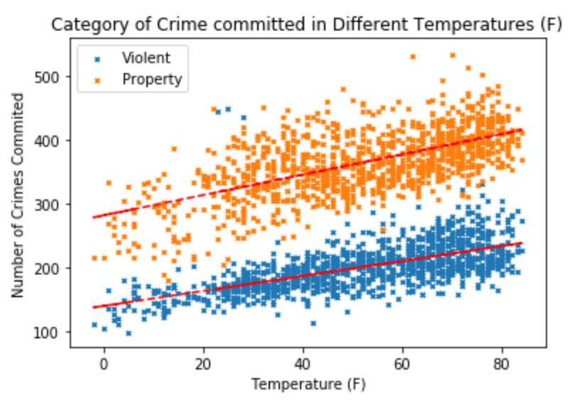
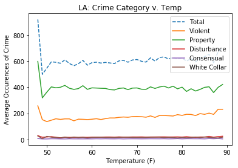
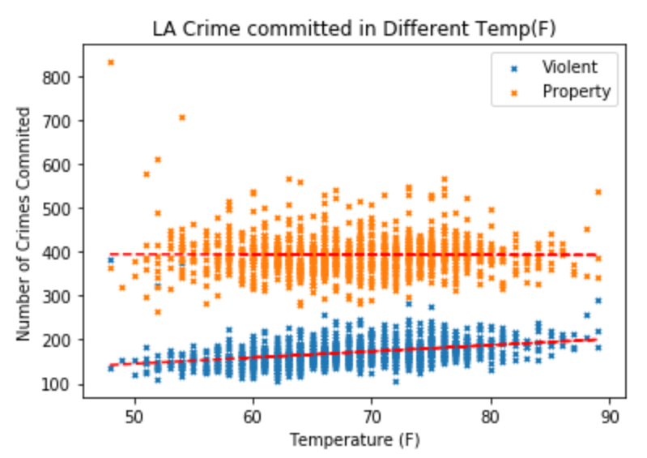
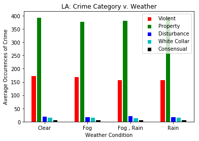
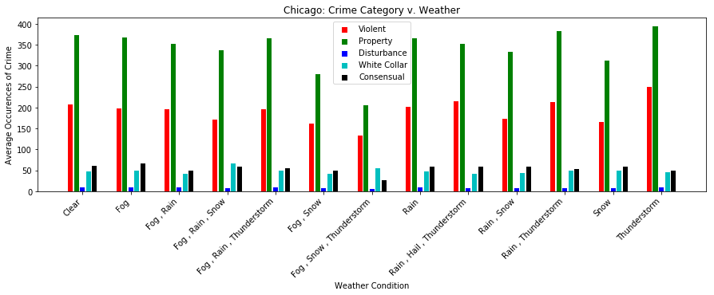

# Weather and Crime

Analytic review of weather effect on crime

Team 1 | Data Analytics Bootcamp | April 4 2018

# Team

Kevin McCurdy

Chris Wong

Amir Afshar

Minh Huynh

Michael Montoya

# Introduction

It is often wondered how crime and weather related.

1. Does weather affect crime incidence? Do crimes occur more often in areas experiencing extreme seasonal weather changes?
2. Does temperature affect crime?
3. What type of crime is affected the most by weather?
4. What contributes to crime occurrences?

# Methods

We did not conduct a randomized sampling of data.  Instead we used all readily available data (weather for every day) and all crimes reported within a day for the past three complete years (2015-2017).

## Study design

### Subjects

We selected two cities of similar size to review.  We chose one city with relatively consistent weather (Los Angeles, to compare to a city with varying weather by season (Chicago).

City1 | Population (2016) | Crime Source | Weather Source
--- | --- | --- | ---
Chicago | 2,704,958[CITATION WkC \l 1033] | Data.gov | Wunderground.com
Los Angeles | 3,976,322[CITATION WKLA \l 1033] | Kaggle.com | Wunderground.com

### Data collection

#### Crime Data

Crime data was collected from the respective city&#39;s data source.  From each data source website, we only filtered for the applicable testing period and retrieved all data attributes provided by the website.  No additional filtering was performed as part of the data collection.

After crime data was retrieved form the various sources, it was modified programmatically to meet the needs of our review.  Utilizing Python/Pandas, we stripped off excess data attributes and retained only: Incident Number/ID, Incident Date, and the City&#39;s classification.

#### Weather Data

Our preferred data would have been Open Weather Map(.com); however due to limitations of collecting historical data an alternate website was selected.  The alternate site selected wunderground.com, does not provide its users a mean to download data or collect via an API.  Instead the team generated the data by selecting the testing period and copying the generated data from the website and pasted into an Excel file.  The manual collection of data required some manipulation in Excel to change the individual days into actual dates.

# Data analysis

#### Crime Data

The raw crime data was reviewed, and we noted that each city has its own classification methodology.  In order for any analysis to make reasonable sense, a standardized categorization would need to be determined and applied to the two data sets.  Based on online inquiries and research we determined the 5 most common crime categories (see Table 1 - Crime Categories ).  Utilizing Python/Pandas techniques and a cross mapping table we assigned our category to the data sets.

Table 1 - Crime Categories

Standardized Crime Category | Definition | Sample City Classifications/subcategories
--- | --- | ---
Consensual | A consensual crime is a public-order crime that involves more than one participant, all of whom give their consent as willing participants in an activity that is unlawful. | Narcotics, Prostitution, Gambling, weapons violation, Pimping, Illegal dumping
Disturbance | is a crime generally defined as the unsettling of proper order in a public space through one&#39;s actions. This can include creating loud noise by fighting or challenging to fight, disturbing others by loud and unreasonable noise (including loud music), or using profanity. | Public peace violation, stalking, obscenity, public indecency, violation of restraining order, contempt of court, pandering, lewd conduct
Property | is a crime to obtain money, property, or some other benefit. This may involve force, or the threat of force, in cases like robbery or extortion | Burglary, theft of identity, vandalism, theft, robbery, arson
Violent | is a crime in which an offender or perpetrator uses or threatens to use force upon a victim. This entails both crimes in which the violent act is the objective, such as murder or rape, as well as crimes in which violence is the means to an end. | Battery, assault, sex offense, homicide, kidnapping, intimidation, human trafficking, child abuse
White Collar | Is crime refers to a financially motivated, nonviolent crime committed by business and government professionals. | Forgery, embezzlement, counterfeit, bribery

The resulting data was then aggregated by date.  Totals were created for Crime Types by date, including a total for all crimes for the day.

#### Weather data

The raw weather data was modified using Python/Pandas to strip excess data attributes.  Only date, average temperature, and Event (Rain, snow, null etc.) were pulled forward.  Using Pandas, the null values for Event were updated to &quot;Clear&quot;.

##### Merged Data

The two data sets were joined by date to create a completed population by City.

# Results

### Temperature affect crime?

The primary question is does temperature affect crime.  Based on a plot of the total number of crimes per day by the average temperature for that day, we can postulate there is a strong correlation as temperatures rise so does the amount of crime.

Table 2 - Temperature vs Number of Crimes

 

### What type of crime is affected the most by weather?

A clear correlation is noted for both Violent and Property crimes for Chicago and Violent Los Angeles.  However, the degree of change is not immediately apparent for the Los Angeles results due to the narrower range of temperatures.

Figure 1 - Chicago Crime type by Temperature

Viewing Figure 1, we can see a clear upward movement for both the Property and Violent crime types.  If we isolate these two crime types (see Figure 2 - Chicago&#39;s most effected types of crime), we see more dramatic correlation.

Figure 2 - Chicago&#39;s most effected types of crime

Unlike Chicago, Los Angeles does not exhibit such a dramatic correlation.  As the temperature range is shorter the crime counts seem relatively consistent.

Figure 3 - Los Angeles Crime type by Temperature

However, after isolating the two highest volume crime types, we can only see a positive correlation with one type: Violent.

Figure 4 - Los Angeles most effected types of crime

### Does weather affect crime incidence?

When we review the data for weather events instead of temperature, we find that the results relatively stagnant for Los Angeles.

Figure 5 - Los Angeles crime by weather Event

Chicago does exhibit some variation based on weather event, but nothing as dramatic as the correlation of crime to temperature.

Figure 6 - Chicago crime by weather Event

# Conclusions

While we cannot conclude that weather actually causes crime, we can support there is a correlation between weather and crime.  Some crimes will continue to happen due to other driving force(s) apart from weather.

# References

_Chicago_. (2018, April 1). Retrieved from Wikipedia.org: https://en.wikipedia.org/wiki/Chicago

_Chicago\History_. (2018, March 21). Retrieved from wunderground.com: https://www.wunderground.com/history/airport/KORD/2015/1/1/CustomHistory.html?dayend=31&amp;monthend=12&amp;yearend=2017&amp;req\_city=&amp;req\_state=&amp;req\_statename=&amp;reqdb.zip=&amp;reqdb.magic=&amp;reqdb.wmo=

_City of Chicago\data.cityofchicago.org_. (2018, March 21). Retrieved from Data.Gov: https://catalog.data.gov/dataset/crimes-2001-to-present-398a4

_City of Los Angeles\data.lacity.org_. (2018, March 21). Retrieved from Data.gov: https://catalog.data.gov/dataset/crime-data-from-2010-to-present

_Los Angeles_. (2018, April 1). Retrieved from Wikipedia.og: https://en.wikipedia.org/wiki/Los\_Angeles

_Los Angeles\History_. (2018, March 21). Retrieved from Underweather.com: https://www.wunderground.com/history/airport/KCQT/2015/1/1/CustomHistory.html?dayend=31&amp;monthend=12&amp;yearend=2017&amp;req\_city=&amp;req\_state=&amp;req\_statename=&amp;reqdb.zip=&amp;reqdb.magic=&amp;reqdb.wmo=

